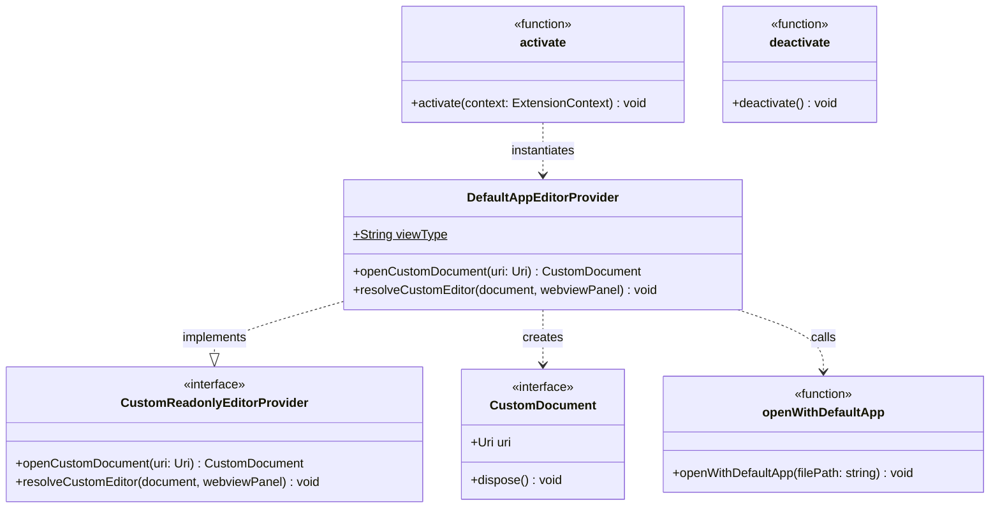
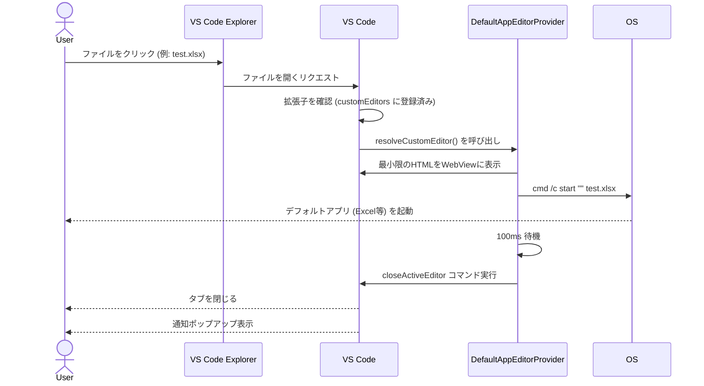

# Open with Default App

VS Code のエクスプローラーでファイルをクリックしたとき、設定した拡張子に一致する場合は
VS Code のエディタで開かずに OS のデフォルトアプリで開きます。

## クラス図



## 動作の仕組み



## 対象拡張子

`package.json` の `customEditors.selector` に列挙された拡張子が対象です。

| カテゴリ | 拡張子 |
|---|---|
| Microsoft Office | `.xlsx` `.xls` `.xlsm` `.docx` `.doc` `.pptx` `.ppt` |
| PDF | `.pdf` |
| 圧縮ファイル | `.zip` `.tar` `.gz` `.7z` `.rar` |
| 実行ファイル | `.exe` `.msi` |
| 動画・音声 | `.mp3` `.mp4` `.avi` `.mov` `.mkv` `.wav` `.flac` |
| デザイン | `.psd` `.ai` `.sketch` |

## OS別の起動コマンド

| OS      | 使用コマンド             |
|---------|-------------------------|
| Windows | `cmd /c start "" <file>` |
| macOS   | `open <file>`            |
| Linux   | `xdg-open <file>`        |

## 設定

### `openWithDefaultApp.showNotification`

ファイルをデフォルトアプリで開いたときに通知を表示するか。デフォルト: `true`

```json
"openWithDefaultApp.showNotification": false
```

---

## ビルド & インストール手順

### 前提

- [Node.js](https://nodejs.org) (v18 以上推奨)

### ビルド

```powershell
.\build.ps1
```

### インストール

```bash
code --install-extension open-with-default-app-0.0.4.vsix
```

または VS Code の `Ctrl+Shift+P` → `Extensions: Install from VSIX...` から選択。
